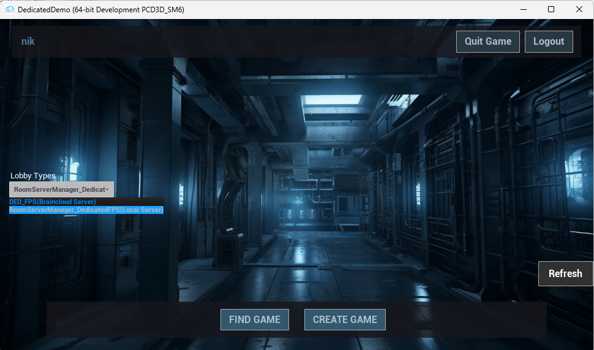

# brainCloud Room Server example using Unreal Engine dedicated server

If you haven't signed up or you want to log into the brainCloud portal, you can do that here:

https://portalx.braincloudservers.com/

## How to set up your app on the brainCloud portal

1. Once logged in to the portal, start by creating a new App

2. Make an account on DockerHub and create a Docker Repo for your dedicated server container

3. In the brainCloud portal, select your app and go to Design-> Servers->My Servers create a new server, you can call this `dedicatedserver` and set the `Server Type` to `Room Server (hosted)` then provide the Docker Registry and Docker Repo you created in the previous step.

4. In Multiplayer->Lobbies set up a new lobby type and call it `DED_FPS` and set the Server of this lobby to the one you created in the previous step, `dedicatedserver`. Also make sure `Disband on start` is unchecked in the lobby rules

Alternatively, after creating your new app, you can simply go to Admin Tools -> Configuration Data, select Import and select the `bcPortalConfig.bcconfig` file in this projects folder, once imported go to your server settings and make sure to set the room serer manager server url to your IP or hostname as well as the docker repo for your dedicated room server.

## How to build and run project in Unreal

1. [Follow these instructions to build Unreal Engine from source](https://docs.unrealengine.com/5.1/en-US/building-unreal-engine-from-source/) Make sure to get the proper version, this project is using UE `5.1.1-0+++UE5+Release-5.1`

2. Once Unreal Engine is built, right click on the `DedicatedDemo.uproject` file and click Generate Visual Studio files

3. Open the DedicatedDemo project in the built version of Unreal, then go to Tools->Open Visual Studio

4. In Visual Studio, build the project by selecting Build->Project Only->Build Only DedicatedDemo, do this for each of these Solution Configurations: Development Client, Development Editor and Development Server.

5. Open the brainCloud widget by going to Tools->brainCloud Settings - then you can input your AppID, AppSecret, Server URL and version in there. You can find this information in the brainCloud portal where you have created your App.

6. You should now be able to run the project in Unreal Engine

## How to build and deploy linux dedicated server

1. First make sure you have CLang - You can download the correct version required for this project [here](https://cdn.unrealengine.com/CrossToolchain_Linux/v20_clang-13.0.1-centos7.exe)

2. You can now build the linux dedicated server by selecting Platforms->Linux->Cook Content and then Package Project and make sure to select DedicatedDemoServer as your Target

3. In the DockerFiles folder, there are 2 files to help with creating a docker image of the built server and deploying it to your DockerHub repository. Copy these files into the folder where you have built your Linux server, and then modify the buildAndDeployDocker.bat file to input your DockerHub repository in the appropriate place. Then you can just run the buildAndDeployDocker.bat to build and deploy your server.

4. Once these steps are complete, you should be able to run the game and start a new server instance which will have your latest changes on the server side.

## Server debugging

If you want to debug your server and hit certain breakpoints both in C++ and Blueprints, follow these steps:

1. Get the RSM tool [here](https://github.com/getbraincloud/braincloud-roomserver-devtool) and follow the set up instructions in the readme, then set `config.debug` to `true` in the `config.js` file and run the RSM tool.
2. Open the Visual Studio solution `DedicatedDemo.sln` file, select Development Editor as your debug configuration 
 and run a debug session. 
3. Once the Unreal editor opens, create a client build of the project:  
and keep this build for a later step
4. Open up the map where our server runs, which is `Content\Maps\Stylized_Egypt_Demo` 
5. Select `Play as Listen Server` in the Unreal editor multiplayer play options  and click the play button.
6. When this first runs, the initial state is an idling server that is waiting to connect to the RSM tool. as long as the RSM tool is running in debug mode, then it should be possible to click the Connect to RSM tool button and see that the connection was successfull.
7. When connected you should see this message next:   - This means the server is now ready to receive the lobbyId
8. To send that lobbyId, launch an instance of your built client executable, which you built in step #3 - in that instance, select `RoomServerManager_DedicatedFPS(Local Server)` as the lobby type in the main menu, and then click the Create Game button. 
9. Once in a lobby, start the game. The RSM tool will then receive your request for a room server and send the lobbyId to your running server in the Unreal editor. You should then see your test player join the server.
10. You can select a connected player in the list on the left and change their information, for example changing their name to `Franco` and then clicking the Update Player Data button  This change propagates to all connected players
11. You can also kill a player with the Kill Player button, and kick them from the game with the Kick Player button.  